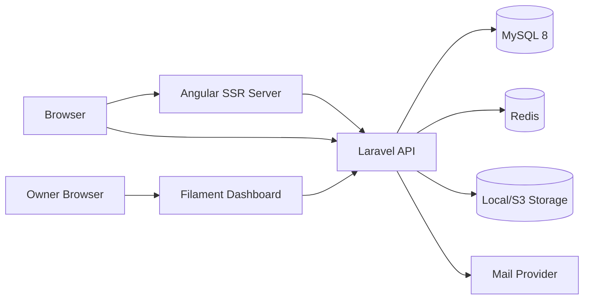

# ARCHITECTURE.md

## Current Repository State

- Current root: `D:\hamza\portfolio`
- Existing foundation files: `AGENTS.md`, `README.md`, `.editorconfig`, `.gitignore`, `.nvmrc`, `project.md`, `docs/`, `.git/`.
- Application state: Laravel backend initialized in `backend/`; Angular frontend initialized in `frontend/`.
- Missing application code: CI files, testimonial moderation dashboard, contact inbox dashboard, analytics dashboard, public website pages, localization/theme implementation, sitemap/robots, and frontend API consumption.
- Decision: keep the requested monorepo layout with `frontend/`, `backend/`, and `docs/` non-destructively. Docker is not used because the selected local environment is Laravel Herd on Windows.

## Verified Local Tools

| Tool | Result |
| --- | --- |
| `php --version` | Not available on PATH |
| `composer --version` | Not available because PHP is missing |
| `node --version` | `v22.13.0` |
| `cmd /c npm --version` | `11.3.0` |
| `cmd /c ng version` | Angular CLI `19.0.7` installed globally; Angular 22 CLI is not available globally |
| `docker --version` | Not available on PATH |
| `docker compose version` | Not available on PATH |
| `docker info` | Not available because Docker CLI is missing |
| `git status --short` | Not a Git repository |
| `herd php -v` | User shell verified PHP `8.4.25`; Codex sandbox cannot see `herd` on PATH |
| `herd composer --version` | User shell verified Composer `2.10.2` through Herd using PHP `8.4.25` |
| `nvm list` | Codex sandbox cannot see `nvm` on PATH; user shell output not yet provided |

Updated verification after Herd runtime selection:

| Tool | Result |
| --- | --- |
| Herd CLI | `Herd 1.30.0` |
| Herd PHP | `PHP 8.5.10` via `C:/Users/hamza/.config/herd/bin/php85/php.exe` |
| Herd Composer | `Composer 2.10.2`, running with PHP `8.5.10` |
| Herd PHP versions | PHP 8.5 installed; global Herd PHP shows 8.6, project `which-php` resolves to 8.5 |
| Herd NVM versions | `24.21.0`, `23.11.0`, `22.22.0` installed |
| Herd-managed Node | `v24.21.0` by direct Herd NVM binary |
| Herd-managed npm | `11.19.0` |
| Angular CLI via `npx @angular/cli@22` | `22.1.8` with Node `24.21.0` |
| Laravel backend | Laravel Framework `13.32.0` |
| Backend PHP constraint | `^8.5` |
| Angular frontend | Angular `22.1.7`, Angular CLI `22.1.8`, npm `11.19.0` |
| Frontend test runner | Vitest `4.1.11` |
| Frontend E2E foundation | Playwright `1.63.0` configured |

FND-005 local service discovery on 2026-09-18:

| Check | Result |
| --- | --- |
| Herd packaged CLI | Found at `C:/Program Files/Herd/resources/app.asar.unpacked/resources/bin/herd.bat` |
| `herd --version` through packaged CLI | Blocked; packaged CLI cannot resolve PHP and reports `No usable PHP version found` |
| `herd php -v` through packaged CLI | Blocked; packaged CLI cannot resolve PHP from this shell |
| `herd composer --version` through packaged CLI | Blocked; packaged CLI cannot resolve PHP from this shell |
| Absolute Herd PHP | `C:/Users/hamza/.config/herd/bin/php85/php.exe`, PHP `8.5.10`, verified usable for Artisan and tests |
| `herd services:list` / `services:available` / `services:versions` | Previously reported `Herd Pro is required to use services`; current packaged CLI is blocked before service discovery because PHP is not resolved |
| Direct `php` | Not available on PATH |
| Direct Composer | Present at `C:/ProgramData/ComposerSetup/bin`, but not used for this project because Laravel work must use Herd Composer |
| Node.js | `v24.19.0` on PATH; supported by Angular 22, but not verified as Herd-managed Node from this shell |
| Angular CLI 22 | `cmd /c npx @angular/cli@22 version` passed with Angular CLI `22.1.8`, Angular `22.1.7`, Node `24.19.0`, npm reported by Angular as `11.19.0` |
| Laravel backend | Boots on PHP `8.5.10`; Laravel `13.32.0`; database driver `mysql`; cache/session/queue drivers `database`; mail driver `log` |
| MySQL local development | MySQL `8.0.41`, verified through Laravel `select version()` and non-destructive migration status |
| MySQL staging/production target | MySQL `8.4 LTS`; migrations and SQL must remain compatible with both local 8.0.41 and target 8.4 |
| Redis/Valkey | Deferred; no local service required for current implemented features |
| Local mail service | Deferred; local development uses Laravel `log` mailer |

## Required Target Versions

The requested baseline is PHP 8.5, Laravel 13, Angular 22, matching Angular CLI and `@angular/core` major versions, and stable compatible releases for TypeScript, RxJS, Node.js, Composer, npm, Filament, and bootstarp CSS.

These versions must be verified against official documentation and package metadata before installation. If Laravel 13, PHP 8.5, Angular 22, or Filament compatibility is not stable and official at implementation time, the compatibility task must be marked blocked rather than forcing prerelease or unsupported packages.

## Compatibility Verification - 2026-09-18

Official documentation and package metadata show that the required stack is mutually compatible when the frontend uses a project-local Angular CLI and a Node.js version that satisfies Angular 22 requirements. The currently installed Node.js `v22.13.0` is not compatible with Angular 22 and must be replaced or bypassed by an approved local runtime before Angular initialization.

| Technology | Selected version | Compatibility status | Verification source |
| --- | ---: | --- | --- |
| PHP | 8.5.10 | Verified stable; not installed locally | https://www.php.net/downloads.php?os=windows |
| Laravel | 13.32.0 | Verified with PHP 8.5; requires PHP `^8.3` | https://packagist.org/packages/laravel/framework |
| Angular | 22.1.7 | Verified stable; requires Node `^22.22.3 || ^24.15.0 || >=26.0.0` | https://angular.dev/reference/versions and npm metadata |
| Angular CLI | 22.1.7 | Verified stable and patch-matchable with Angular framework 22.1.7; use project-local `npx`, not global CLI | npm package metadata for `@angular/cli@22.1.7` |
| Node.js | 24.21.0 LTS | Selected replacement; satisfies Angular `^24.15.0`; local `v22.13.0` is blocked | https://nodejs.org/dist/index.json and https://angular.dev/reference/versions |
| npm | 11.19.0 with Node 24.21.0 | Verified through Node 24.21.0 metadata; local npm 11.3.0 can run but local Node is too old for Angular 22 | https://nodejs.org/dist/index.json |
| Composer | 2.10.3 | Verified latest stable; cannot run locally until PHP is installed | https://getcomposer.org/download/ |
| Filament | 5.8.2 | Verified compatible; requires PHP `^8.2` and Filament support package supports Illuminate `^11.28|^12.0|^13.0` | https://filamentphp.com/docs/5.x/introduction/installation and https://packagist.org/packages/filament/filament |
| Bootstrap | 5.3.8 | Verified stable npm package; no Angular peer dependency. Use only if a later decision changes the original Tailwind requirement. | https://registry.npmjs.org/bootstrap/latest |
| MySQL | 8.4 LTS | Verified preferred MySQL 8 line; MySQL 8.0 reached EOL in April 2026 | https://dev.mysql.com/doc/relnotes/mysql/8.0/en/ and https://dev.mysql.com/doc/refman/8.4/en/mysql-releases.html |
| Redis | 8.10.1 | Verified stable GA; Redis Open Source latest release line is usable for cache/queue, while Redis 8.2 is the extended support line | https://redis.io/docs/latest/operate/oss_and_stack/install/version-mgmt/ and https://download.redis.io/releases/ |
| Laravel Sanctum | 4.3.3 | Verified compatible with Laravel 13 and PHP 8.5; requires PHP `^8.2` and Illuminate `^11|^12|^13` | https://packagist.org/packages/laravel/sanctum |
| Spatie Laravel Permission | 8.3.0 | Verified compatible with Laravel 13 and PHP 8.5; requires PHP `^8.3` and Illuminate `^12|^13` | https://packagist.org/packages/spatie/laravel-permission |
| Pest | 5.2.1 plus `pestphp/pest-plugin-laravel` 5.0.1 | Verified compatible with PHP 8.5 and Laravel 13. Latest plugin requires Laravel `^13.23.0`, satisfied by Laravel 13.32.0 | https://packagist.org/packages/pestphp/pest and https://packagist.org/packages/pestphp/pest-plugin-laravel |
| Playwright | 1.63.0 | Verified compatible with selected Node 24; requires Node `>=20` | https://registry.npmjs.org/@playwright/test/latest |
| Angular SSR | `@angular/ssr` 22.1.8 or patch-aligned 22.1.x | Verified Angular 22 package; use with Angular CLI SSR setup | https://angular.dev/best-practices/performance/ssr |
| Angular hydration | `@angular/platform-browser` 22.1.7 | Verified package and stable `provideClientHydration` API | https://angular.dev/guide/hydration |
| Transloco | `@jsverse/transloco` 8.4.0 | Verified compatible with Angular 22 through peer dependency `@angular/core >=16`; supports runtime language changes and SSR schematic option | https://jsverse.gitbook.io/transloco/getting-started/installation |

## Compatibility Result

- Stack status: verified compatible with required replacement runtime versions.
- Local host status: verified through Herd PHP 8.5 and Herd-managed Node.js 24 LTS.
- Docker status: intentionally not selected. This project uses Laravel Herd on Windows for local PHP/Composer instead of Docker.
- Angular CLI strategy: do not use the global CLI `19.0.7`; use a project-local Angular CLI 22 command during frontend initialization, for example `npx -p @angular/cli@22.1.7 ng new ...`.
- PHP strategy: use PHP 8.5 through Laravel Herd. Do not use direct `php`/`composer` commands unless Herd exposes them; prefer `herd php` and `herd composer`.
- Node strategy: use Node.js 24 LTS through Herd's Node/NVM workflow or another explicitly approved per-project Node version manager. Do not use local Node `v22.13.0` for Angular 22.

## Required PHP Extensions

Minimum required from package metadata and planned project features:

- Laravel framework required extensions: `ctype`, `filter`, `hash`, `mbstring`, `openssl`, `session`, `tokenizer`.
- Laravel Sanctum: `json`.
- Filament: `intl`.
- Database: `pdo`, `pdo_mysql`.
- Media/uploads and Composer workflows: `fileinfo`, `curl`, `zip`.
- XML/HTML processing and common Laravel packages: `dom`, `xml`.
- Recommended for image/media work: `gd` or `imagick`.
- Recommended for Redis queues/cache if using PHP extension instead of Predis: `redis`.

## Known Local Blockers

- Herd command shims are not visible on the Codex sandbox PATH, so commands should use absolute Herd binary paths when run by Codex.
- Direct `node` still resolves to `v22.13.0` in the Codex sandbox PATH; Node 24 commands must prepend or directly invoke `C:/Users/hamza/.config/herd/bin/nvm/v24.21.0`.
- Herd PHP startup prints an OPcache API warning. PHP, Composer, extension listing, and version checks still exit successfully; monitor this during Laravel initialization.
- Docker CLI and Docker Compose are not selected and should not be used.
- Global Angular CLI is `19.0.7` and must not be used for this Angular 22 project.
- FND-005 was completed using the absolute Herd PHP executable, local MySQL `8.0.41`, database-backed cache/session/queue drivers, and the Laravel log mailer. Redis/Valkey, Mailpit/SMTP, and MySQL 8.4 staging/production verification are tracked as deferred infrastructure tasks.

## Herd Runtime Commands Required Before FND-002

Run these from `D:\hamza\portfolio` in the same shell where Herd is available:

```powershell
herd --version
herd php:list
herd which-php
nvm list
```

PHP 8.5 is selected for this project. If it needs to be re-applied later, use:

```powershell
herd isolate 8.5
herd php -v
herd composer --version
```

Node.js 24.21.0 is installed in Herd NVM. In Codex-run commands, use direct binary paths or temporarily prepend the Herd Node directory:

```powershell
$nodeDir="$env:USERPROFILE\.config\herd\bin\nvm\v24.21.0"
$env:PATH="$nodeDir;$env:PATH"
node --version
npm --version
```

## Frontend Architecture

- Angular 22.1.7 standalone application in `frontend/`.
- Angular Router with lazy-loaded page routes.
- Angular SSR and hydration are configured through `@angular/ssr`, `src/server.ts`, `src/main.server.ts`, `src/app/app.config.server.ts`, `src/app/app.routes.server.ts`, and `provideClientHydration()`.
- Production SSR build output is generated at `frontend/dist/portfolio-frontend` with browser output in `browser/` and server output in `server/`.
- Prerender suitable static pages such as privacy and selected content pages when data availability allows.
- CSS is the initial stylesheet format for the Angular foundation.
- Tailwind, Bootstrap, Transloco, final design system, API integration, public pages, and final SEO services are deferred to later tasks.
- Transloco or equivalent maintained runtime translation solution for UI text.
- Angular services/repositories for API access; components stay focused on rendering and local UI state.
- Signals for local UI state such as theme menu, language choice, and small interaction states.
- RxJS for API workflows and asynchronous forms.
- Reactive Forms for contact and testimonial submissions.
- Dedicated SEO service for localized metadata, canonical links, `hreflang`, Open Graph, Twitter/X cards, and JSON-LD.
- Current shell is intentionally minimal: title `Portfolio Platform`, an English `lang` attribute, semantic `<main>`, and no `noindex` metadata.

## Backend Architecture

- Laravel 13.32.0 application in `backend/`.
- PHP requirement is constrained to `^8.5`.
- Current installed backend packages are the Laravel skeleton defaults only: `laravel/framework`, `laravel/tinker`, and development tooling for Faker, Pail, Pint, Mockery, Collision, and PHPUnit.
- Portfolio business migrations and Eloquent model layer are implemented for projects, media, testimonials, blog, services, experience, skills, contact messages, site settings, social links, SEO metadata, and privacy-conscious analytics.
- Filament `5.8.2` is installed for the owner dashboard. Sanctum, Spatie Permission, and media packages are not installed yet.
- Filament content resources are implemented for projects, project categories, technologies, project media, blog posts, blog categories, tags, services, skills, experience, site settings, social links, and SEO metadata through parent resource forms.
- Backend app name is `Portfolio Platform API`.
- Backend timezone is UTC.
- Default locale is English (`en`), and supported locales are documented as `en,ar`.
- Versioned public read API under `/api/v1` is implemented for site, about, projects, project taxonomies, testimonials, blog posts, blog taxonomies, services, and social links.
- Anonymous public write API endpoints under `/api/v1` are implemented for project views, project likes/unlikes, testimonial submissions, and contact submissions.
- API Resources shape all implemented public read responses.
- Form Requests validate public read query parameters, public write payloads, locale values, consent fields, and honeypot spam controls.
- Public API controllers are intentionally thin. They convert validated requests into DTOs where needed, call one `App\Services\PublicApi` application service, and return an API Resource response.
- Public API orchestration lives in `App\Services\PublicApi`; reusable Eloquent query construction, filtering, visibility rules, relationship loading, aggregate counts, pagination, related-content selection, and localized slug lookup live in `App\Queries\PublicApi`.
- Public API filter/value objects live in `App\Data\PublicApi`.
- Actions/services for business workflows.
- Policies/Gates for dashboard authorization.
- Filament for dashboard resources and analytics widgets.
- Sanctum for dashboard/API authentication where required.
- Laravel notifications, mail, queues, and scheduler for messages, cleanup, and analytics aggregation.
- MySQL 8 as the primary database and Redis for queues/cache where beneficial.
- Local MySQL `8.0.41` is accepted for initial development. Staging/production targets MySQL `8.4 LTS`, and migrations must remain compatible with both.

## Authentication Flow

- Public read endpoints do not require authentication.
- Public write endpoints use validation, rate limiting, spam protection, and privacy-conscious visitor identifiers.
- Public writes are stateless and anonymous. Sanctum is not used for public visitor interactions at this stage.
- Visitor identifiers are resolved only from a first-party encrypted HTTP-only cookie or generated by the server. Request bodies are never trusted for visitor identity.
- Interaction rows store HMAC hashes for visitor ID, IP, and user agent. Raw IP addresses and raw user-agent strings are not stored in public interaction tables.
- Dashboard access uses authenticated Laravel users.
- Filament is registered at `/admin` through `App\Providers\Filament\AdminPanelProvider`.
- Dashboard registration is disabled. Owner/admin accounts are provisioned interactively with `herd php artisan portfolio:provision-owner-admin`.
- Dashboard authorization requires `users.is_admin=true`; authentication alone is not enough.
- Dashboard responses send `X-Robots-Tag: noindex, nofollow, noarchive` and private `no-store` cache headers.
- Admin locale is resolved from `?locale=en|ar`, the admin session, or `Accept-Language`; Filament renders English LTR and Arabic RTL.
- Filament uses a monochrome neutral color palette with light/dark mode enabled.
- Public visitor cookies are not admin authentication credentials.
- Filament resources enforce policies.
- Filament content resources keep presentation concerns in resources/pages and delegate create/update/delete workflows to focused services under `App\Services\Admin\Content`.
- Public APIs never expose dashboard-only fields or visitor identifiers.
- Model serialization hides visitor hashes, user-agent hashes, contact emails, contact phone numbers, and admin notes by default.

## API Communication

- Angular communicates with Laravel through environment-configured base URLs.
- Local development origins are `http://localhost:4200`, `http://127.0.0.1:4200`, `http://localhost:4000`, and `http://127.0.0.1:4000`; production CORS must not use wildcard origins.
- CORS supports credentials for the explicit allowed origins so the public visitor cookie can flow between Angular and Laravel. Wildcard CORS is not allowed.
- Locale is conveyed through a `locale=en|ar` query parameter or an `Accept-Language` header; unsupported locales return validation errors.
- Responses use consistent success, error, and pagination shapes. Paginated lists use Laravel pagination `links` and `meta` with an added `meta.locale`.
- Public cache headers are applied to safe read endpoints with a 60-second TTL.
- Write endpoints return authoritative state after optimistic UI attempts.
- Public write endpoints return `no-store` responses.
- BE-003 detail endpoints resolve localized JSON slugs in query services. ADM-002 added MySQL generated columns and unique indexes for admin-managed localized slugs while preserving SQLite test portability.

## Admin Content Workflow Architecture

- Filament resources define forms, bilingual tabs, table columns, filters, uploads, and action wiring only.
- Persistence orchestration lives in focused services under `App\Services\Admin\Content`, including project content, blog content, localized taxonomy/service records, profile content, site settings, catalog technologies, SEO metadata, localized slugs, rich-text sanitization, and media files.
- Content update services preserve existing translations when only one language is edited.
- English and Arabic slug values are normalized independently. Application validation checks duplicates before persistence, and MySQL generated-column unique indexes protect concurrent writes.
- Rich content is sanitized server-side before persistence. The current allowlist includes paragraphs, headings, lists, blockquotes, pre/code, strong/emphasis, line breaks, and safe links.
- Public API query/services remain the source of public visibility and localization behavior; admin resources do not duplicate public response business rules.
- No persistent application cache entries are currently populated for public content, so there is no cache store invalidation to perform yet. Future stored cache use must add invalidation inside these admin services.

## Public Write Workflow Architecture

- Project views: `ProjectInteractionController` validates transport input, resolves locale/slug, and delegates to `RegisterProjectView`. The service runs in a database transaction and records at most one view per project, visitor hash, and UTC date.
- Project likes: `LikeProject` and `UnlikeProject` run in transactions and return authoritative like counts for idempotent POST/DELETE workflows.
- Testimonial submissions: `StoreTestimonialRequest` validates consent, payload size, optional published project association, and prohibits moderation fields. `SubmitTestimonial` creates a pending testimonial and dispatches `TestimonialSubmitted` after commit.
- Contact submissions: `StoreContactMessageRequest` validates consent and payload size, prohibits dashboard-only fields and attachments, and `SubmitContactMessage` creates a private new contact message before dispatching `ContactMessageSubmitted` after commit.
- Visitor identity: `ResolvePublicVisitor` and `VisitorIdentity` issue and resolve the encrypted first-party cookie, then expose a `VisitorContext` containing only HMAC hashes and a privacy-safe rate-limit key to write requests.
- Rate limits are named by endpoint family: `public-project-views`, `public-project-likes`, `public-testimonials`, and `public-contact`.
- Contact attachments remain deferred until private storage, validation, size limits, malware-scanning expectations, and dashboard access controls are configured.

## Media Storage Strategy

- Local public storage during development.
- S3-compatible storage support in production through Laravel filesystem abstraction.
- Store original file metadata, MIME type, size, alt text, captions, sort order, and video poster.
- Admin uploads use `PORTFOLIO_MEDIA_DISK` and configurable image/video MIME and size allowlists.
- Uploaded project and cover media are stored with server-generated filenames. Executable and unsafe SVG/HTML-style uploads are rejected by MIME allowlists.
- Replacement deletes the previous file only after the new path is persisted, and shared referenced files are retained.
- Project media deletion removes unreferenced stored files and poster files through the filesystem abstraction.
- Image previews are available in Filament forms/tables for images and poster-backed videos.
- Image transcoding and video conversion are not implemented.
- Prefer WebP/AVIF images where supported and WebM/MP4 for walkthroughs.
- Responsive image variants and lazy loading are frontend requirements.

## Analytics Flow

- Track project views and likes through first-party visitor identifiers, hashed IP values using a server-side secret, user-agent hash where appropriate, project ID, and time windows.
- Count one unique project view per project, visitor, and UTC calendar day. This implements the current `project_views` unique constraint; a true rolling 24-hour window would require a future schema/service change.
- Public analytics and visitor interaction tables do not store raw IP addresses.
- Aggregate analytics through scheduled jobs where useful.
- Document limitations from VPNs, shared networks, deleted cookies, and changing IPs in the privacy page.

## Translation Strategy

- Use translation files for interface strings.
- Use JSON translation columns for manageable dynamic content by default. BE-001 implements JSON columns for localized content and slug values. ADM-002 adds MySQL generated-column unique indexes for localized slug uniqueness on routed content tables and keeps application validation for clear editor feedback.
- BE-002 adds `HasLocalizedAttributes::localized($attribute, $locale, $fallback)` for explicit locale reads without coupling models to HTTP request state or the global app locale. English and Arabic arrays remain directly accessible through casts.

## Authorization Strategy

- BE-002 registers a reusable dashboard policy for current business models.
- ADM-001 replaces the broad initial dashboard policy with explicit administrator authorization.
- Authenticated dashboard users may view and manage dashboard-owned content only when `users.is_admin=true`.
- Guest users are denied by Laravel's policy user typing before controller or dashboard code is introduced.
- Fine-grained roles and permissions remain deferred until a later permissions task.

## Development Seed Strategy

- BE-002 adds a production-guarded development seeder with small fictional bilingual content.
- Seeders use predictable keys and `updateOrCreate` where practical.
- Seeders do not truncate tables, seed analytics events, create real credentials, or include real client data.

```json
{
  "title": {
    "ar": "عنوان المشروع",
    "en": "Project title"
  }
}
```

- Reassess translation tables only if localized querying, indexing, or editorial workflows require them.

## Caching Strategy

- Cache public site settings, navigation, featured content, and stable lists.
- BE-003 read endpoints return short public cache headers but do not yet use Redis or application cache storage.
- Use database-backed cache/session/queue drivers for local development until Redis or Valkey is configured and verified.
- Use Redis or Valkey for Redis-dependent features, Horizon if selected, distributed locks, and production queue configuration only after the deferred infrastructure task is complete.
- Invalidate caches from dashboard content mutations.
- Avoid caching private dashboard responses.

## Queue Strategy

- Queue email notifications, media processing, analytics aggregation, and slow cleanup operations.
- Local development uses the database queue driver.
- Production should use Redis or Valkey queue drivers once the deferred infrastructure task is complete.
- Document worker and scheduler commands in deployment docs.

## Deployment Topology


